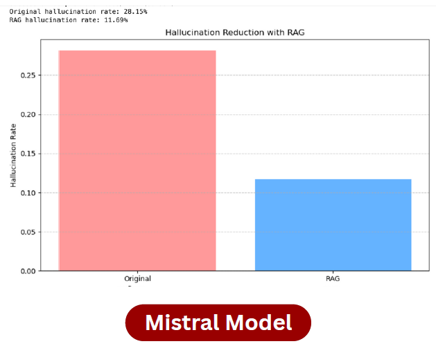
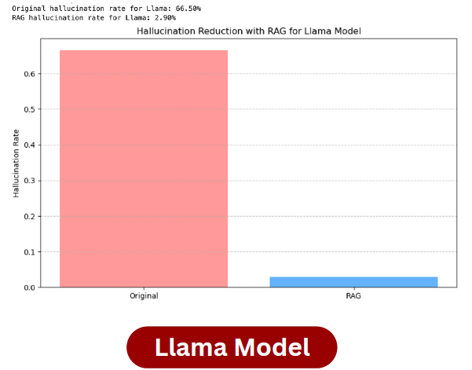
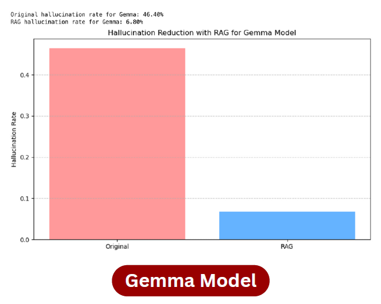

# 🧠 LLM Hallucination Detection and Reduction Framework
### CSCI 544 Applied Natural Language Processing (NLP) Project - USC Spring 2025

This project implements a comprehensive framework to **detect and reduce hallucinations** in Large Language Models (LLMs) using a multi-stage pipeline involving NLI-based inference, entropy-based uncertainty, and retrieval-augmented generation (RAG).

## 🚀 Overview

Hallucinations in LLMs refer to confidently generated but **factually incorrect or unsupported outputs**. This framework addresses the problem in two stages:

1. **Detection**: Identify hallucinated responses using:
   - **RoBERTa** for Natural Language Inference (NLI)
   - **Entropy scoring** using GPT-2
   - **Wikipedia-based fact-checking**

2. **Reduction**: Mitigate hallucinations using:
   - **Retrieval Augmented Generation (RAG)** with **LangChain**, **Pinecone**, and **Together API**

## 📊 Key Results

| Metric                          | Value   |
|--------------------------------|---------|
| Average Detection Accuracy     | **87%** |
| Average Detection F1 Score               | **78%** |
| Average Hallucination Reduction | **39%** |

Models Tested: **LLaMA**, **Gemma**, **Qwen**, **Mistral**, **Bloom**

  

  
  
  

## 🧰 Tech Stack

- Python (Transformers, HuggingFace, Wikipedia-API, GPT-2)
- RoBERTa (NLI)
- GPT-2 (Entropy scoring)
- LangChain, Pinecone, Together API (RAG)
- Jupyter Notebooks

## 📌 Future Work

- Benchmark against other open LLMs (e.g., Falcon, Orca).
- Support multimodal hallucination detection.

---
